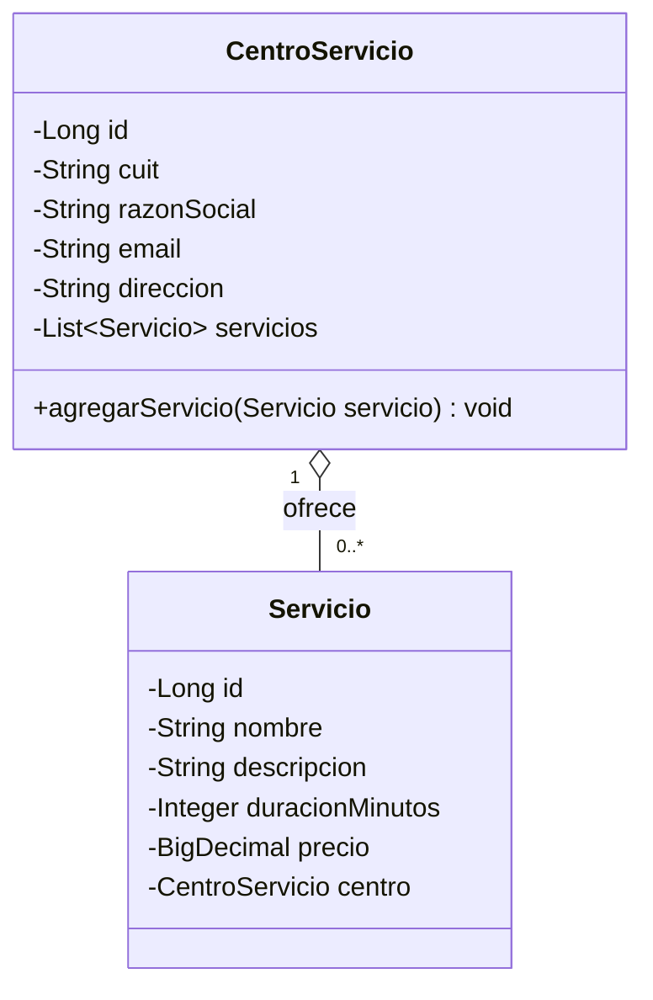

# Simulacro resuelto — TurnoGo (referencia, no es el parcial real)

Este documento guarda el enunciado del simulacro y los artefactos ya
generados (diagramas en Lucid + specs reutilizables) para no tener que
rehacerlos de cero el día del parcial real. El dominio real va a cambiar
(no se va a llamar TurnoGo), pero el **flujo de trabajo y los formatos
reutilizables sí sirven**: copiar el bloque Mermaid / JSON de acá, cambiar
nombres de entidades/atributos/reglas, y listo — ahorra tokens de
regenerar la sintaxis desde cero.

## Enunciado (resumen)

**Contexto:** TurnoGo administra Centros de Servicio que ofrecen Servicios
a clientes. Alcance del examen: registrar un Servicio en un Centro
existente (clientes/turnos quedan fuera de alcance).

**Reglas de negocio:**
- El CUIT identifica a un Centro y no puede repetirse.
- El email del Centro debe tener formato válido.
- Un Servicio pertenece a un único Centro; un Centro ofrece varios Servicios.
- El precio de un Servicio debe ser mayor que cero.
- Para registrar un Servicio, el Centro informado debe existir.
- Reglas de negocio resueltas desde el Service, no desde el Repository.

**Entregables y puntaje:** Caso de Uso (15) · Diagrama de Clases (15) ·
DER (10) · Persistencia JPA (15) · Repository (10) · DTO+Service+reglas
(25) · Prototipo funcional (10) · Bono Controller/API REST (+10).

## Caso de Uso: Registrar un Servicio

- **Actor principal:** Administrador del Centro de Servicio.
- **Objetivo:** Incorporar un nuevo Servicio al catálogo de un Centro existente.
- **Precondiciones:** el Centro (por CUIT) ya existe; el actor tiene los datos del Servicio.
- **Flujo principal:**
  1. El actor ingresa CUIT del Centro + datos del Servicio (nombre, descripción, duración, precio).
  2. El sistema localiza el Centro por CUIT.
  3. Valida que el Centro exista.
  4. Valida que el precio sea > 0.
  5. Construye el Servicio y lo asocia al Centro.
  6. Persiste el Servicio (queda registrada la relación).
  7. Informa el resultado exitoso.
- **Alternativos:**
  - A1 — Centro inexistente (paso 3): rechazo, sin persistir cambios.
  - A2 — Precio inválido (paso 4): rechazo, sin persistir cambios.
- **Postcondición:** el Servicio queda persistido y asociado a su Centro.

## Diagrama de Clases — Mermaid (reutilizable con `lucid_create_diagram_from_mermaid`)



Lucid generado: https://lucid.app/lucidchart/1a10a338-9e46-4e20-8a8c-0fe38939772f/edit

## DER — entities/relationships (reutilizable con `lucid_create_erd`)

```json
{
  "entities": [
    {
      "id": "centro_servicio",
      "name": "CENTRO_SERVICIO",
      "attributes": [
        {"name": "id", "type": "bigint", "key": "PK"},
        {"name": "cuit", "type": "varchar", "key": "UK"},
        {"name": "razon_social", "type": "varchar"},
        {"name": "email", "type": "varchar"},
        {"name": "direccion", "type": "varchar"}
      ]
    },
    {
      "id": "servicio",
      "name": "SERVICIO",
      "attributes": [
        {"name": "id", "type": "bigint", "key": "PK"},
        {"name": "nombre", "type": "varchar"},
        {"name": "descripcion", "type": "varchar"},
        {"name": "duracion_minutos", "type": "int"},
        {"name": "precio", "type": "numeric(12,2)"},
        {"name": "centro_id", "type": "bigint", "key": "FK"}
      ]
    }
  ],
  "relationships": [
    {
      "from": "servicio",
      "to": "centro_servicio",
      "fromAttribute": "centro_id",
      "toAttribute": "id",
      "fromCardinality": "many",
      "toCardinality": "one",
      "label": "ofrece"
    }
  ]
}
```

Lucid generado: https://lucid.app/lucidchart/2959889c-b2b0-44c5-a388-70a4ab8be2d2/edit

## Código de referencia

El código completo (Entities, DTOs, Repositories, Services, Controller
bono, DemoDataLoader, pom.xml, application.properties) ya está resuelto y
documentado como patrón general en [`CONVENTIONS.md`](./CONVENTIONS.md).
No se copia acá para no duplicar: `CONVENTIONS.md` tiene los snippets
genéricos, este archivo tiene el caso concreto que los originó.

## Flujo para el día del parcial real (ahorro de tokens)

1. Leer el enunciado nuevo una sola vez y extraer: entidades, atributos,
   relaciones (multiplicidad), reglas de negocio explícitas.
2. Armar el Mermaid del Diagrama de Clases **copiando la estructura de
   arriba** (mismo formato `classDiagram` con `o--` y multiplicidades),
   cambiando solo nombres/atributos → `lucid_create_diagram_from_mermaid`.
3. Armar el JSON del DER **copiando la estructura de arriba** (mismo
   formato `entities`/`relationships` con PK/FK/UK y cardinalidades),
   cambiando solo nombres/atributos → `lucid_create_erd`.
4. Recién ahí generar el código siguiendo `CONVENTIONS.md`, verificando
   que los nombres coincidan exactamente entre Caso de Uso, Diagrama de
   Clases, DER y código (la cátedra penaliza fuerte la inconsistencia).
